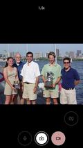

[English](README.md) | Japanese

# Simple Camera (PWA & Android Hybrid)

React 19 と Vite 7 で構築された、高性能なカメラWebアプリケーションです。PWAとしての動作に加え、Androidネイティブアプリとしての高度な連携機能を備えています。

<p align="center">
  　　
  
</p>

## 🌟 主な機能

* **高度なカメラ操作**: 写真撮影、動画録画（WebM）、リアルタイムズーム、パン操作。
* **QRコード解析**: `zxing-wasm` を使用した高速なスキャン機能。
* **Android ネイティブ連携**:
* **物理ボタン対応**: 音量ボタンをシャッターとして利用可能。
* **インセット対応**: Androidのノッチやシステムバーを考慮したセーフエリア設計。
* **バイブレーション**: 撮影時の触覚フィードバック。
* **国際化 (i18n)**: 日本語と英語に対応し、OS設定に基づき自動切り替え。
* **座標変換**: キャンバス上の描画とビデオ映像の正確な座標マッピング。

## 🛠 技術スタック

### Frontend (Web)

* **Framework**: React 19 (TypeScript)
* **Build Tool**: Vite 7
* **PWA**: `vite-plugin-pwa` (Service Worker によるオフライン対応)
* **Library**:
    * `lucide-react` (アイコン)
    * `i18next` (多言語対応)
    * `zxing-wasm` (コード解析)
    * `@fix-webm-duration/fix` (録画データの再生時間修復)

### Backend (Android Native)

* **言語**: Kotlin 1.9
* **UI**: WebView (WebViewAssetLoader によるセキュアなローカル読み込み)

## 🚀 開発とビルド

### Web側セットアップ

```bash
# 依存関係のインストール
npm install

# 開発サーバー起動
npm run dev

# ビルド（ビルド後、自動的にAndroidのアセットフォルダへコピーされます）
npm run build

```

### Android側セットアップ

1. `npm run build` 実行後、`app/src/main/assets/camera` にファイルが生成されていることを確認します。
2. Android Studio で `android` フォルダを開きます。
3. ビルド＆実行します。

## 📁 プロジェクト構造 (主要部)

```text
src/
├── components/           # UIコンポーネント (Webcam, Controls, Canvas)
├── libs/                 # ユーティリティ、権限管理、i18n、デバイス管理
├── App.tsx               # アプリのエントリポイント・メッセージ受信
android/
├── app/src/main/assets/  # Webビルド成果物の配置先
└── app/src/main/java/... # Kotlinによるネイティブ実装 (WebViewClient, ChromeClient)
```

## 📝 ライセンス

* MIT License

## 👤 開発者

* **片山博文MZ** (katahiromz)
* [katayama.hirofumi.mz@gmail.com](mailto:katayama.hirofumi.mz@gmail.com)
